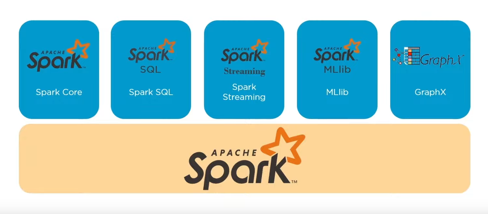

# PySpark Projects

## Introduction

Welcome to the PySpark project! PySpark is a powerful tool for big data processing and analysis, built on top of Apache Spark. It allows you to work with large datasets in a distributed computing environment.

This project demonstrates various aspects of PySpark through different notebooks and scripts. Below is a summary of what each notebook covers:

## Notebooks

- **[pyspark ml.ipynb](pyspark%20ml.ipynb)**: This notebook focuses on machine learning tasks with PySpark's MLlib library, covering scalable algorithms and utilities.

- **[pyspark sql.ipynb](pyspark%20sql.ipynb)**: This notebook demonstrates SQL operations using PySpark SQL, allowing structured data querying and manipulation.

- **[pyspark streaming.ipynb](pyspark%20streaming.ipynb)**: This notebook deals with real-time data processing using PySpark Streaming, handling continuous data streams efficiently.

- - **[pyspark graphX.ipynb](pyspark%20graphX.ipynb)**: This notebook explores graph processing capabilities using PySpark's GraphX library.

## Scripts

- **[streaming.py](streaming.py)**: This Python script implements specific functionality for streaming data processing using PySpark's Streaming API.

## Datasets

In the `Datasets` directory, you will find the following datasets used in the notebooks:

- `car.csv`: Dataset related to cars, used for various analyses.
- `seeds_dataset.csv`: Dataset containing data about seeds, used for agricultural analysis.

Feel free to explore each notebook and script to understand how PySpark can be leveraged for different types of data processing tasks.

