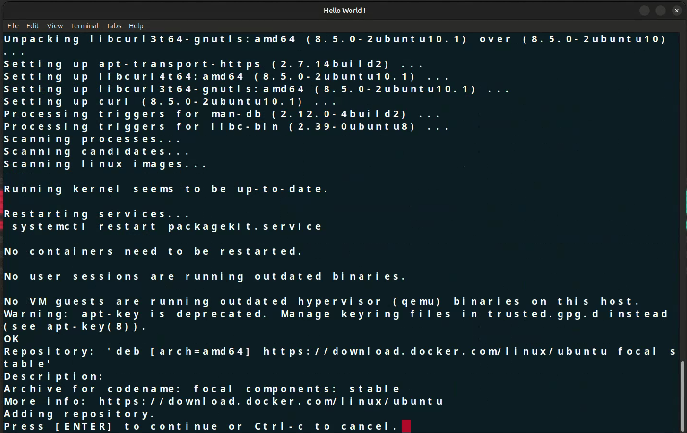

# Setting up Jupyter PySpark Notebook on a Cloud Instance

## 1. Spin up a Cloud Instance

1. Log in to your cloud service provider (e.g., AWS, Azure, GCP).
2. Create a new instance with the following specifications:
    - **Instance type:** Choose an appropriate instance type (e.g., t2.medium for AWS).
    - **Operating system:** Ubuntu 20.04 LTS.

## 2. Enable Inbound Rules for Ports 8888, 4040, 4041

1. Navigate to the security group settings for your instance.
2. Add the following inbound rules:
    - **Port 8888:** Custom TCP rule, Source: Anywhere (0.0.0.0/0)
    - **Port 4040:** Custom TCP rule, Source: Anywhere (0.0.0.0/0)
    - **Port 4041:** Custom TCP rule, Source: Anywhere (0.0.0.0/0)

## 3. Log in to the Instance


1. Open a terminal on your local machine.
2. SSH into the instance using the public IP address (replace `your_instance_ip` with the actual IP address):

    ```bash
    ssh -i /path/to/your/private-key.pem ubuntu@your_instance_ip
    ```

## 4. Clone the Repository and Navigate to the Setup Directory

1. Once logged in to the instance, clone the repository:

    ```bash
    git clone https://github.com/kousikveerappan/Big-data
    ```

2. Navigate to the `Setup` directory:

    ```bash
    cd Big-data/Setup
    ```

## 5. Run the Installation Script

1. Make the script executable:

    ```bash
    sudo chmod +x install.sh
    ```

2. Run the script:

    ```bash
    sudo ./install.sh
    ```
    
     - Press enter to continue the installation.
     
 
## 6. Access Jupyter PySpark Notebook

After the installation is complete, copy the container ID of the running Jupyter PySpark notebook container:

<br>

Then fetch the logs for the container using:

 ```bash
    sudo docker logs <container_id>
 ```
 
Locate the access URL in the logs, which typically looks like:


```
http://127.0.0.1:8888/lab?token=xxxxxxxxxxxxxxxxxxxxxxxxxxxxxxxxxxxxxx
```

Modify this URL by replacing 127.0.0.1 with your instance's public IP address and use it in your browser:


```
http://<instance_public_ip>:8888/lab?token=xxxxxxxxxxxxxxxxxxxxxxxxxxxxxxxxxxxxxxxxxx
```
Make sure that the inbound rules for ports 8888, 4040, and 4041 are enabled in your cloud provider's security group settings to access Jupyter PySpark Notebook from your browser.


     

